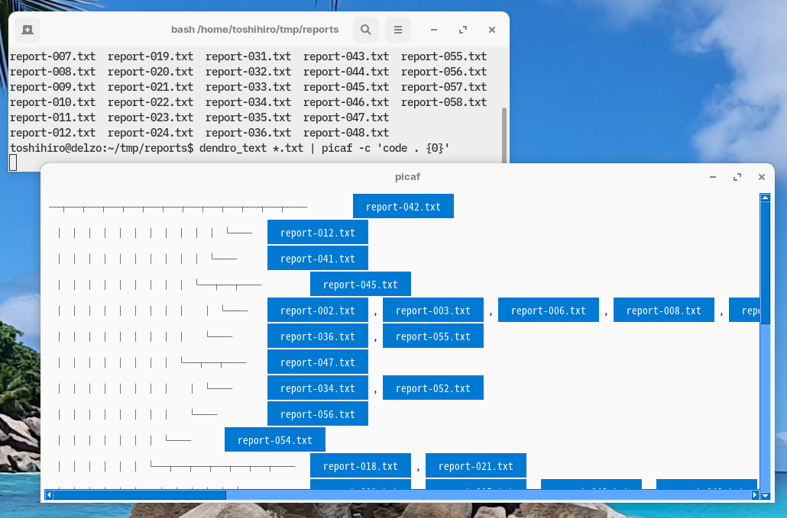
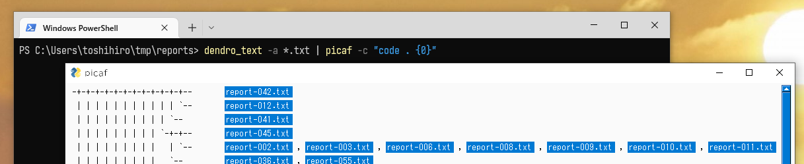
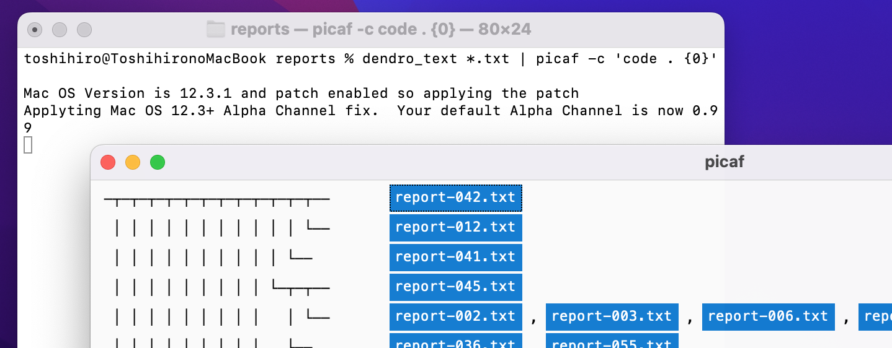

# picaf

`picaf` (Pick-up a file) is a tool to generate a clickable map of files.

Show the window that allows you to click filenames, from text containing file names.

A slightly similar tool is `python -m http.server`, which serves a web page including links to files in local directories.

## Installation

```sh
pip install picaf
```

If you get a ModuleNotFoundError when you run `picaf`,

```sh
$ picaf -h
....
ModuleNotFoundError: No module named 'docopt'
```

Install docopt-ng additionally.

```sh
pip install docopt-ng
```

For Ubuntu/Mac users:  

When `picaf` exits with an error such as `ModuleNotFoundError: No module named 'tkinter'`, install tkinter as follows:

```sh
apt install python3-tk
```

or

```sh
brew install python-tk
```

## Usage

```sh
picaf [options] [<textfile>]
```

Launch a GUI application that displays text in the argument files, after convert each filename written in text into a clickable button.

By default, each time a button is pressed, print the filename. With the option `-c`, you can execute the specified command for the filename.

### Options

```
-c COMMAND, --command=COMMAND     Command line for the clicked file. `{0}` is a place holder to put a file name.
-p PAT, --pattern=PAT     Pattern to filter / capture files.
-n, --dry-run             Print commands without running.
-b, --batch               Batch mode. Run command for each file name found in the text file.
-e, --shell-escape        Shell-escaping file names in expanding `{0}`.
--font=NAMESIZE           Specify font name and size, e.g. `"Noto Sans,12"`
--font-list               Print the fonts installed.
--theme=THEME             Specify theme [default: LightGray].
--theme-preview           Show theme previewer.
```

### Example of Use/Screenshots

`picaf` was originally designed for use with [dendro_text](https://github.com/tos-kamiya/dendro_text), which finds the similarity of text files generate a dendrogram.

In this example, make the filenames clickable in the output of `dendro_text` so that you can investigate the content of each file with a text editor.

**Ubuntu**



**Windows**



**Mac**


